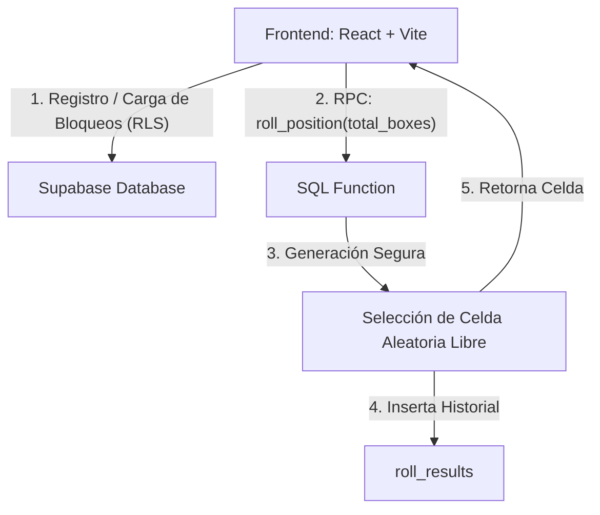

# Pokémon Box Randomizer 📦➡️🥚

Un sistema web moderno y responsivo diseñado para gestionar cajas de huevos (o criaturas), permitiendo bloquear celdas específicas y generar de forma segura posiciones aleatorias no bloqueadas. El diseño visual está fuertemente inspirado en la interfaz del Sistema de Cajas del PC de **Pokémon Escarlata y Púrpura**.

---

## 🚀 Arquitectura del Proyecto

El proyecto está estructurado en una arquitectura clásica de **Frontend (Single Page Application)** + **Backend-as-a-Service (Supabase)**.



---

## 🎨 Características Principales

- **Interfaz Estilo Consola (Pokémon SV)**: Estética oscura de alta calidad con destellos violeta/azul, tipografía moderna (*Outfit* de Google Fonts), animaciones fluidas y soporte para navegación multipestaña (*Cajas Normales* y *Cajas Especiales*).
- **Matriz de Celdas Interactiva (5x6)**: Cada caja contiene 30 espacios configurables. Al hacer clic en un huevo (`/egg.png`), este se marca como bloqueado (mostrando un indicador visual traslúcido con una cruz roja ❌).
- **Generador de Tiradas Seguro (Server-Side)**: Realiza la selección aleatoria de celdas libres directamente en la base de datos a través de una función remota (RPC), garantizando que no se puedan trucar ni manipular las selecciones en el lado del cliente.
- **Persistencia en la Nube y Autenticación**: Inicio de sesión y registro de entrenadores. Todos los datos (perfil del total de cajas, celdas bloqueadas y resultados de tiradas) se guardan en tiempo real asociados a la cuenta del usuario.
- **Importación/Exportación en JSON**: Permite a los usuarios descargar un respaldo local con las celdas bloqueadas o importar uno previo para sincronizarlo inmediatamente con la base de datos.
- **Modo Desarrollo (Auto-Login)**: Cuenta con inicio de sesión automático usando credenciales preestablecidas para agilizar las pruebas locales.

---

## 📁 Estructura del Repositorio

- `frontend/`: Aplicación de cliente desarrollada en **React (TypeScript)**, **Vite** y **CSS personalizado**.
- `supabase_schema.sql`: Script SQL completo con las tablas, triggers, políticas de seguridad RLS y funciones necesarias para inicializar la base de datos en Supabase.

---

## ⚙️ Funcionamiento Interno y Base de Datos

El motor del proyecto reside en la base de datos Postgres de Supabase. El esquema está diseñado bajo el principio de **seguridad a nivel de fila (RLS)**, garantizando la privacidad de los datos de cada entrenador.

### 1. Modelo de Datos (Tablas)
- **`public.profiles`**: Almacena el ID del usuario y la configuración general (por ejemplo, `total_boxes` que por defecto es 1).
- **`public.blocked_positions`**: Registra los bloqueos activos de cada usuario con la tupla `(box, row, col)`.
- **`public.roll_results`**: Guarda un historial detallado de todas las tiradas generadas con marcas de tiempo.

### 2. Sincronización Automática de Perfiles
Un trigger de Postgres asocia de forma automática un perfil en `public.profiles` cada vez que una nueva cuenta se registra en el sistema de autenticación de Supabase (`auth.users`):
```sql
CREATE OR REPLACE TRIGGER on_auth_user_created
  AFTER INSERT ON auth.users
  FOR EACH ROW EXECUTE FUNCTION public.handle_new_user();
```

### 3. El Algoritmo de Selección Aleatoria (`roll_position`)
Cuando el usuario pulsa en **"Generar Tirada"**, el frontend no calcula la celda; en su lugar, realiza una llamada RPC a la función SQL `roll_position(total_boxes)`. Este algoritmo realiza los siguientes pasos de forma segura en el servidor:
1. **Verificación**: Obtiene el ID del usuario autenticado de manera segura (`auth.uid()`).
2. **Generación**: Crea virtualmente todas las coordenadas posibles basadas en el número de cajas configuradas:
   $$\text{Total Posiciones} = \text{total\_boxes} \times 5 \text{ filas} \times 6 \text{ columnas}$$
3. **Filtro**: Resta del conjunto todas las coordenadas que el usuario tiene bloqueadas en `blocked_positions`.
4. **Selección**: Ordena aleatoriamente las posiciones disponibles utilizando `ORDER BY random() LIMIT 1`.
5. **Registro**: Inserta la posición ganadora en la tabla de historial `roll_results`.
6. **Retorno**: Envía de vuelta la posición seleccionada. Si no quedan celdas libres, lanza una excepción controlada.

---

## 🚀 Guía de Instalación y Ejecución en Local

### Requisitos Previos
- **Node.js** (versión 18 o superior recomendada).
- Una cuenta y un proyecto creado en **Supabase**.

### Pasos

1. **Configurar la Base de Datos**:
   - Accede al panel de tu proyecto en Supabase, ve al apartado **SQL Editor** y pega los contenidos de [supabase_schema.sql](file:///c:/Users/Rafael/Documents/BoxRando/BoxRando/supabase_schema.sql). Ejecuta la consulta para crear las tablas, políticas y la función RPC.

2. **Configurar las Variables de Entorno**:
   - En el directorio `frontend/`, crea un archivo `.env` tomando como base `.env.example` y rellena las variables con la URL y la clave anónima (public anon key) de tu proyecto de Supabase:
     ```env
     VITE_SUPABASE_URL=https://tu-proyecto.supabase.co
     VITE_SUPABASE_ANON_KEY=tu-clave-anon-key
     ```

3. **Instalar Dependencias**:
   - Abre la terminal dentro de la carpeta `frontend/` y ejecuta:
     ```bash
     npm install
     ```

4. **Iniciar Servidor de Desarrollo**:
   - Ejecuta el servidor local:
     ```bash
     npm run dev
     ```
   - Abre la URL (habitualmente `http://localhost:5173`) en tu navegador.
